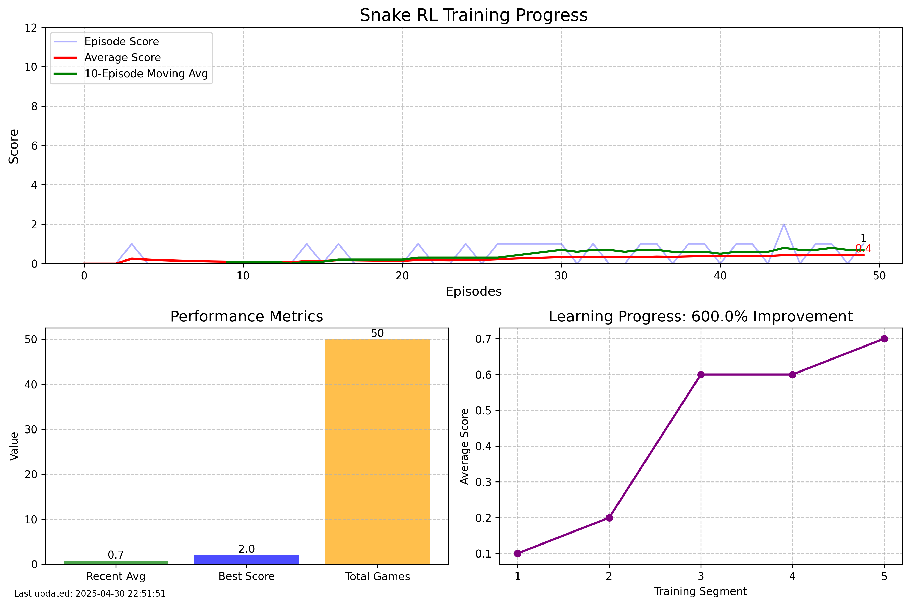
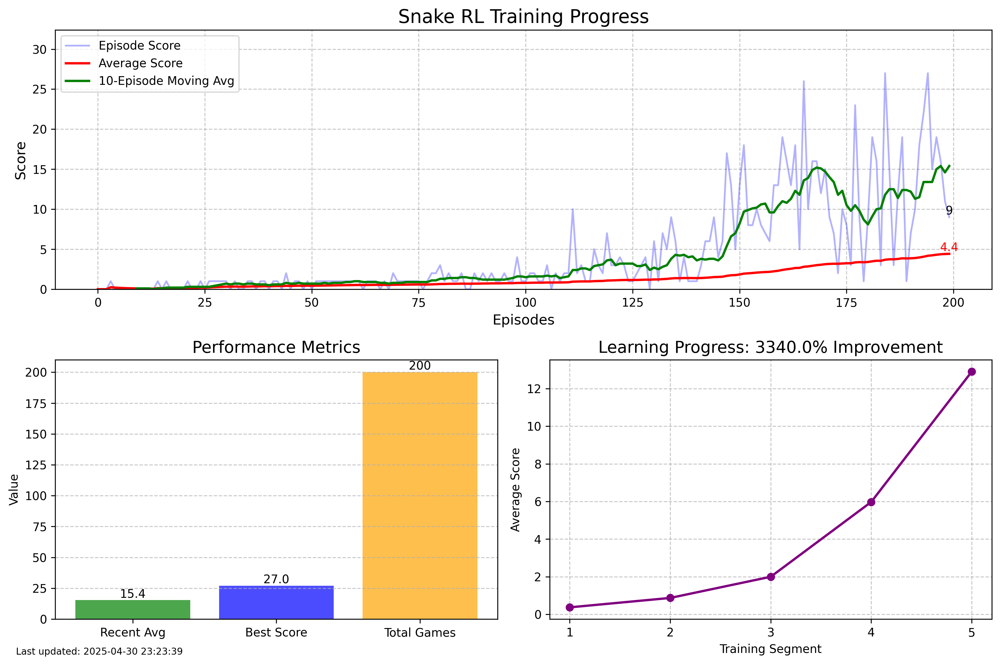

# Snake RL: A Deep Q-Learning Snake Game

## About the Project

Snake RL is a reinforcement learning project that trains an AI agent to play the classic Snake game using Deep Q-Learning. The agent learns to navigate the game environment, collect food, and avoid collisions through experience and neural network-based decision making.

## Requirements

- Python 3.6+
- PyTorch
- NumPy
- Pygame
- Matplotlib
- IPython

## Installation

1. Clone the repository:
```bash
git clone https://github.com/lakshmimahadevan22/snake-rl.git
cd snake-rl
```

2. Create and activate a virtual environment 
```bash
python -m venv venv
source venv/bin/activate 
```

3. Install the required packages:
```bash
pip install torch numpy pygame matplotlib ipython
```

## Running the Project

To start training the agent:
```bash
python agent.py
```

## Project Structure

- `agent.py`: Contains the `SnakeAgent` class for DQN-based learning and decision making
- `game.py`: Implements the `SnakeEnvironment` class providing the game mechanics and rendering
- `model.py`: Defines the neural network architecture and training components
- `visualization.py`: Handles real-time visualization of training metrics
- `trained_models/`: Directory where trained models are saved 
- `training_plots/`: Directory where training progress plots are saved

## Working

Snake RL uses a Deep Q-Network (DQN) approach to train an agent to play the game. 

## Overview of the process:

**State Representation**: The game state is represented as an 11-element vector containing:
* Danger detection in three directions (straight, right, left)
* Current movement direction (one-hot encoded)
* Food relative position (left/right/above/below)

**Action Space**: The agent can choose from 3 actions:
* Go straight
* Turn right
* Turn left

**Reward Structure**:
* +10 for eating food
* -10 for game over (collision with wall or self)
* Small positive reward (+0.1) for moving closer to food
* Small negative reward (-0.1) for moving away from food

**Learning Process**:
* The agent explores the environment with a high initial exploration rate.
* Exploration rate decreases as more games are played.
* Experiences (state, action, reward, next_state, done) are stored in a replay buffer.
* The agent learns from batches of experiences via gradient-based optimization.
* Both immediate learning and batch learning from experience replay.

## Training Results

Below are the visualizations of the training process:





